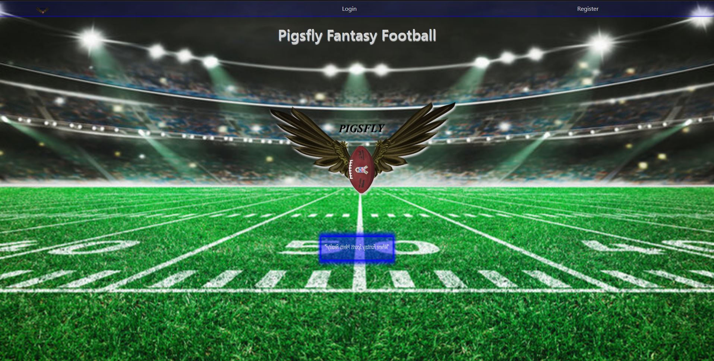
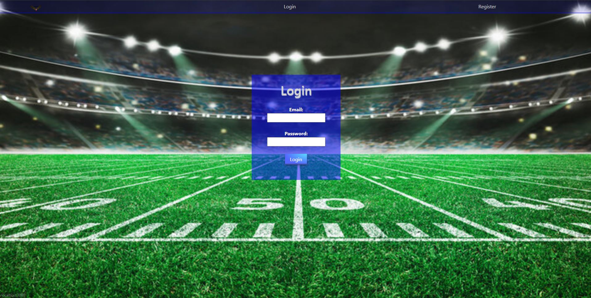
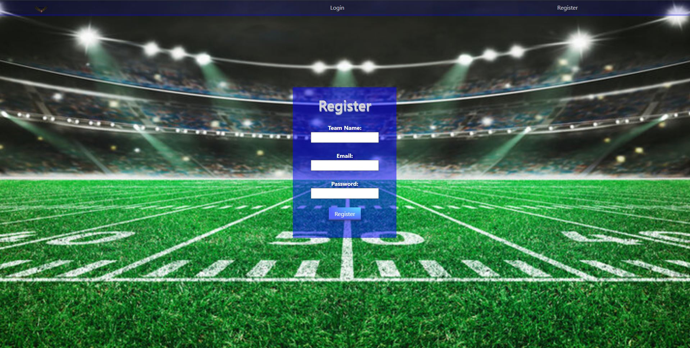
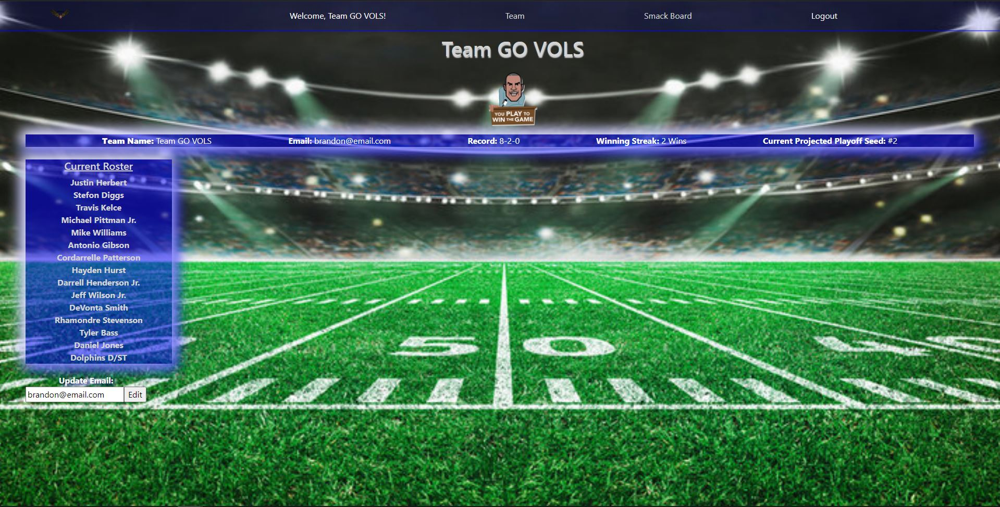
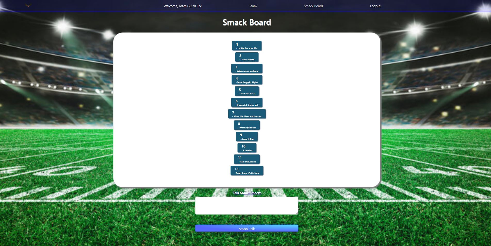
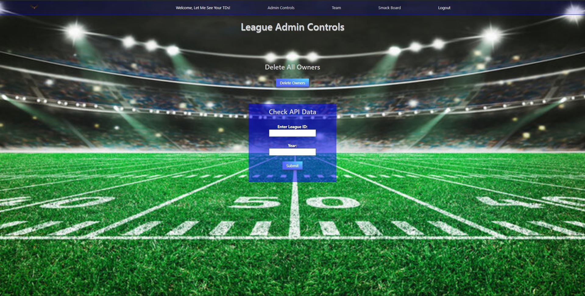

# PigsflyFF

## Description

PigsflyFF is a fantasy football league application built for a "highly competitive" fantasy football league. League members can signup and login to view their fantasy football team and even talk to "trash" to one another.

This application Fullstack application built using the MERN stack.

The API used in this project is no longer public and may have to be updated in the near future.

## Usage

This application is for members of the Pigsfly Fantasy Football League that are interested in quickly checking their rosters and chatting with other league members.

## Sample Screenshots

## Technologies 

JavaScript, MongoDB Atlas, Express, ReactJS, NodeJS, React RouterV6, React-Bootstrap, Axios, Mongoose, jsonwebtoken, bcrypt, CSS

## Technical Challenges

- Working on some of the CRUD operations 
    - Could not decide what I wanted to actually update
- API issues
    - The API that I used is extremely complex. It is also no longer public, so there is not up to date documentation.

## Future Implementations

- Add and/or improve CRUD operations.
- Implement payment options for league members to pay annual dues
- Frontend updates
    - Make more mobile responsive  

## Credits

- Although they were doing their work with Python, I must give credit to these two:
    - Tim Bryan | View His YouTube Channel [YouTube](https://youtu.be/S_ax0rjAoXE) |
    - Learn With Jabe | View His YouTube Channel [YouTube](https://youtu.be/3KtgCsTg97E) |
- Background Image Credit: © Adobe Stock
- ESPN

## Deployment

- This React app is deployed through Netlify and cyclic. You can view the live site through this URL: https://pigsflyff.netlify.app

## License

[MIT]
(https://choosealicense.com/licenses/mit/)
